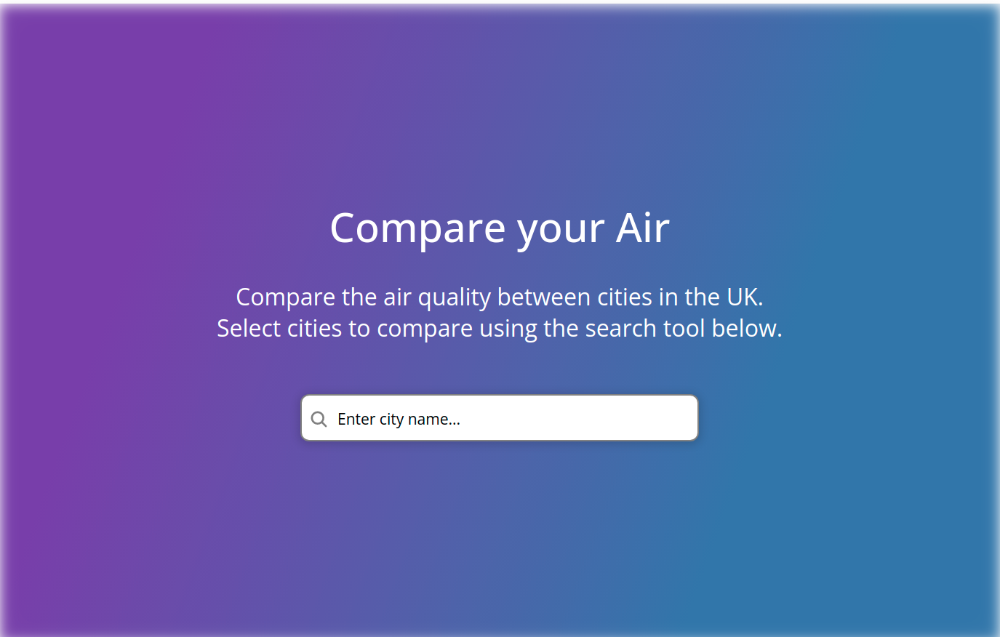
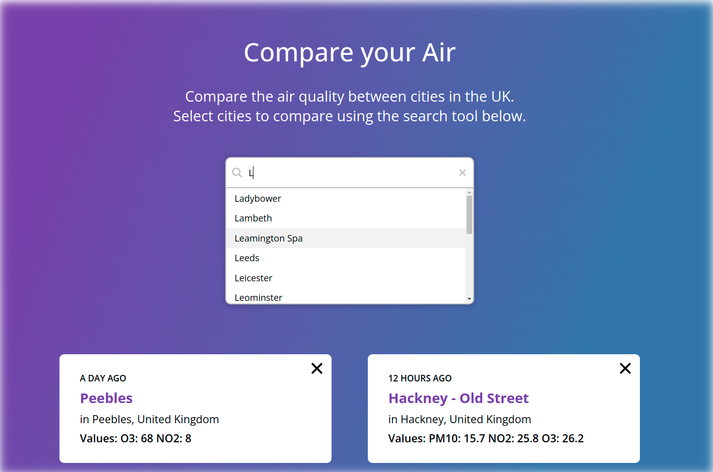

# Compare your Air by Alex Ludlow

## [Live deployment link <----](https://air-quality-comparison.netlify.app/)

### Using the [Open AQ Air Quality API](https://docs.openaq.org/), this React web app allows users to compare air quality across cities in the UK. Project aims include:

### The search box to be an autocomplete select input to allow the user to search and select a city, from a list of options. These options will be filtered from a larger list of options, based on the current input;

- ### Upon selection of an item from the search box, a card will appear listing:

- ### The time the statistics were last updated in an easy to read format, e.g. “an hour ago”, “1 day ago”, “6 weeks ago” etc.;

- ### The location name;

- ### The city name and country;

- ### The air quality values at time of retrieval, as detailed in the design.

- ### Additionally, each card should have a remove call-to-action in the top right corner, which removes the card when clicked.

# Built with

- ## React;
- ## Styled Components;
- ## framer-motion;
- ## TypeScript;
- ## Axios;
- ## Moment.js;
- ## React testing library;
- ## Netlify

# Preview

## Desktop:

## Tablet:

## Mobile:

## By Alex Ludlow
